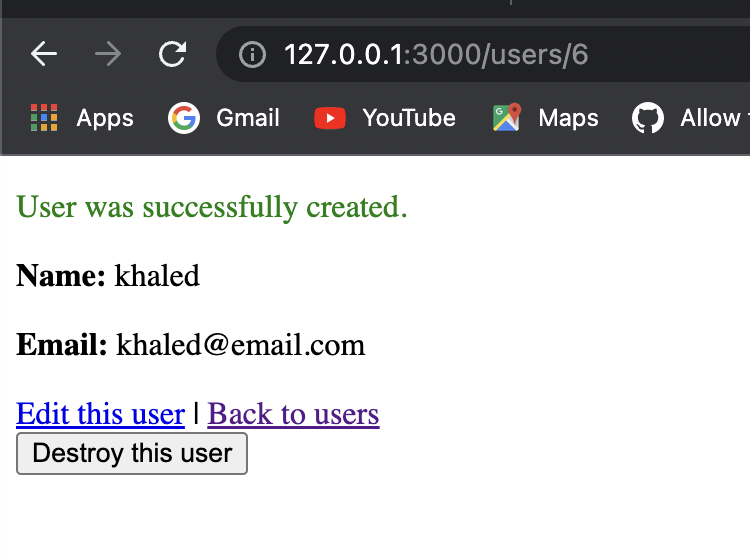
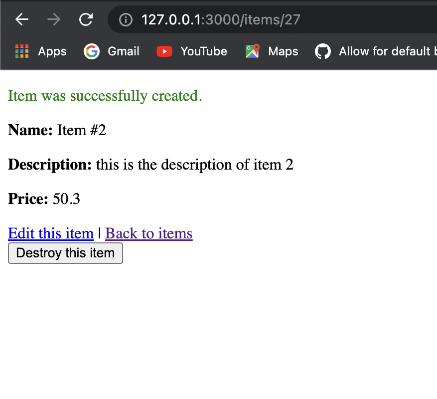
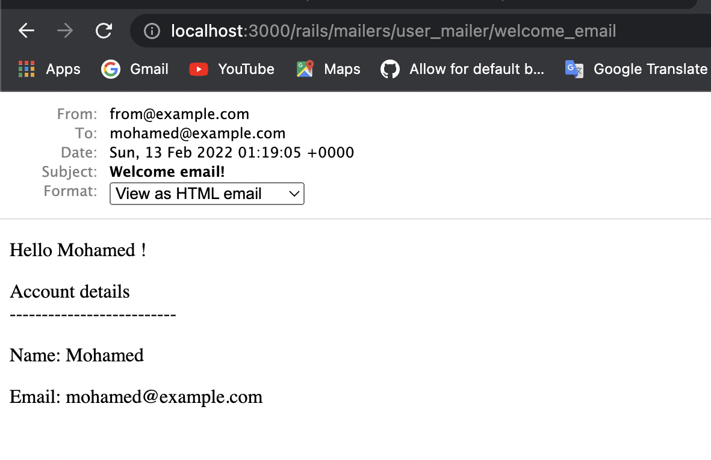
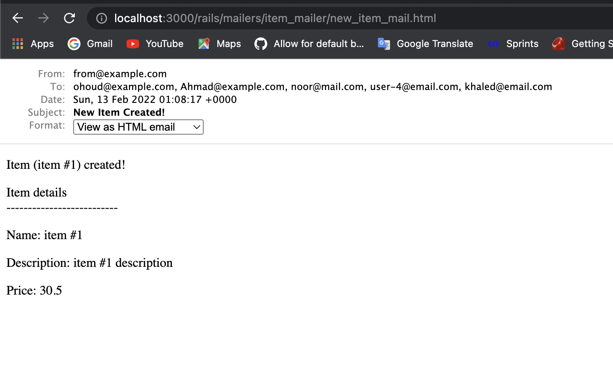
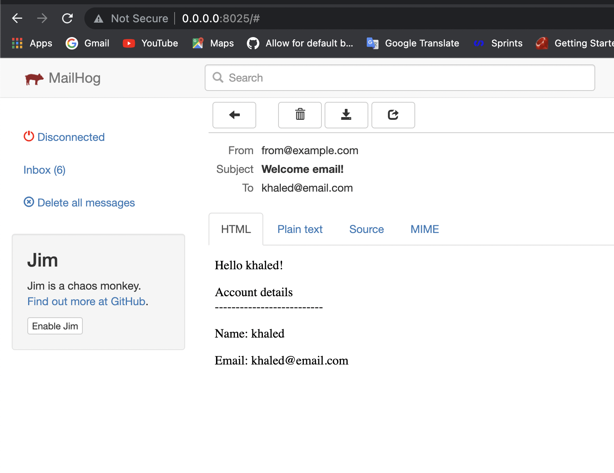
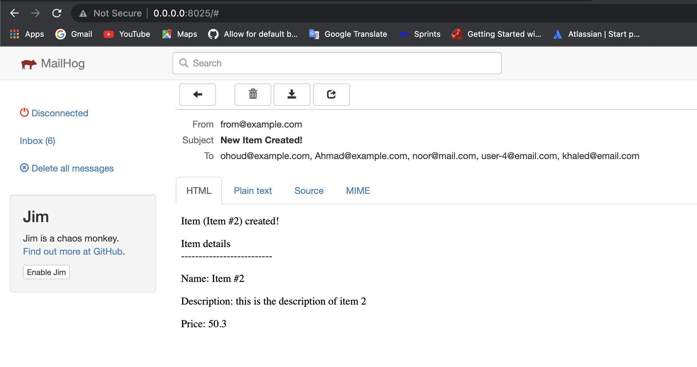

# README

## OverView
This project is a practice for Rails Mailer.

What's done in this project:
- create a user and item scaffold.
- sent a welcome mail for every user created in the system.
- every item created sent mails to all users in this system.

## Screenshots

### Records Creation

- create User

- create Item

### Preview

#### ActionMailer preview

- user preview

- item preview

#### Mailhog preview

- user preview

- item preview

## References
- [Ruby On Rails documentation](https://guides.rubyonrails.org/v5.1/getting_started.html)
- [Action Mailer Documentation](https://guides.rubyonrails.org/action_mailer_basics.html)
- [Presentation Code Snippets](https://mnaser.notion.site/Code-Snippets-6ee287636e94496799d45a04d94f7cac)
- [debug With Mailhog](https://arsfutura.com/magazine/debugging-rails-mails-with-mailhog/)

